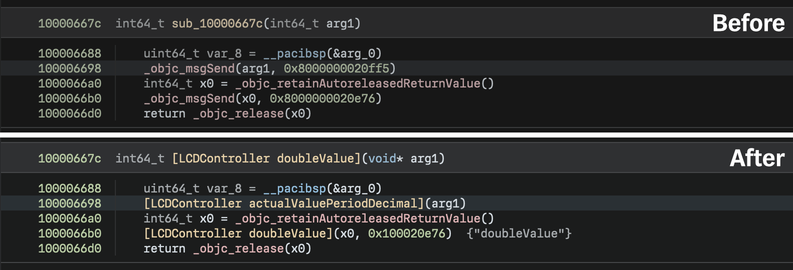

# Objective Ninja

Objective Ninja is a Binary Ninja plugin to assist in reverse engineering
Objective-C code.

**NOTICE: Objective Ninja is a work-in-progress and is not production-ready.**
There are known issues with the current Objective-C structure analysis, and a
rewrite is planned for the near future to addresss these issues. For more
details and the latest information, see
https://github.com/jonpalmisc/ObjectiveNinja/issues/25.

## Features

Objective Ninja is still in early development, but already has a handful of
useful features.

### Method Call Cleanup



> Before/after method call cleanup & symbol creation.

Objective Ninja can replace calls to `objc_msgSend` with direct calls to the
relevant method's implementation, as shown above. Also shown is Objective
Ninja's ability to define symbols for class methods using class and selector
data.

### Structure Analysis

As mentioned previously, Objective Ninja parses Objective-C structures found in
the binary. Objective Ninja will also define types for all necessary Objective-C
structures and create data variables for them automatically.

## Limitations

Only the `x86_64` and `arm64` architectures are supported; support for other
architectures is not planned.

## Roadmap

There are numerous other features planned and on the way; see issues marked with
the "feature" tag for more information.

## Build & Installation

Objective Ninja is currently only offered in source code form; to use Objective
Ninja, you will need to build it yourself. The good news is that building it
isn't very difficult.

**NOTICE:** At this time (3 January 2021), the Workflows API is only available
on the `dev` branch of the API repo. As such, the vendored submodule points to a
recent commit on that branch. Once the Workflows API is available in Binary
Ninja 3.0, you may modify the submodule to point to a specific commit you are
targeting.

Clone the Objective Ninja repository, initialize the Binary Ninja API submodule,
then run CMake and build:

```sh
git clone https://github.com/jonpalmisc/ObjectiveNinja.git && cd ObjectiveNinja
git submodule update --init --recursive
cmake -S . -B build -GNinja
cmake --build build
```

Once complete, `libObjectiveNinja` will be available in the build folder; copy
it to your Binary Ninja user plugins folder, then start reversing. :)

### Troubleshooting

```
CMake Error at vendor/api/CMakeLists.txt:58 (find_library):
  Could not find BN_CORE_LIBRARY using the following names: binaryninjacore,
  libbinaryninjacore.so.1
```

If you encounter an error that looks like the one above, you may have to
explicitly set the `BN_CORE_LIBRARY` option when invoking CMake, done as
follows:

```sh
cmake ... -DBN_CORE_LIBRARY="PATH_HERE"
```

However, this should be determined automatically and not have to be
configured by hand.

See the [Binary Ninja User
Documentation](https://docs.binary.ninja/guide/plugins.html) if you aren't sure
where your user plugins folder is.

## Contributing

Contributions in the form of issues and pull requests are welcome! For
more information, see [CONTRIBUTING.md](CONTRIBUTING.md).

## License

Copyright &copy; 2022 Jon Palmisciano; licensed under the BSD 3-Clause license.
